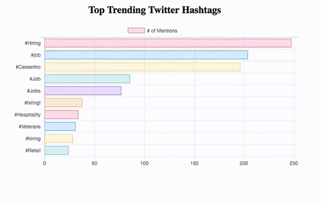

# Twitter-API-with-Spark
In this project, I build a simple application that reads online streams from Twitter using Python, then processes the tweets using Apache Spark Streaming to identify hashtags and, finally, returns top trending hashtags and represents this data on a real-time dashboard. For different analyses we can customize hastags in code for what we are trying to analyse.

## Tech and Libraries

- Twitter API V2
- Spark
- Flask
- Tweepy

## Screenshots

|  |
| :--:|
| *Example for Hiring Hastags* |

